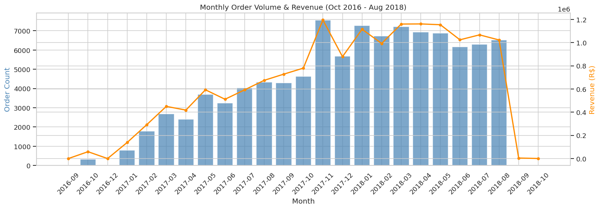
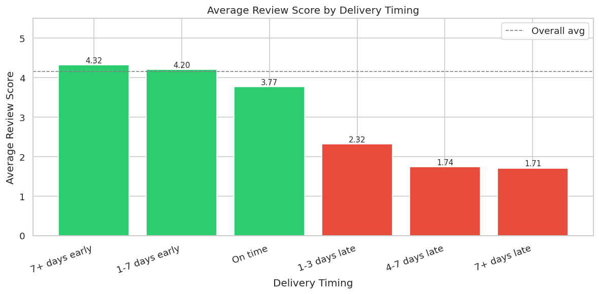
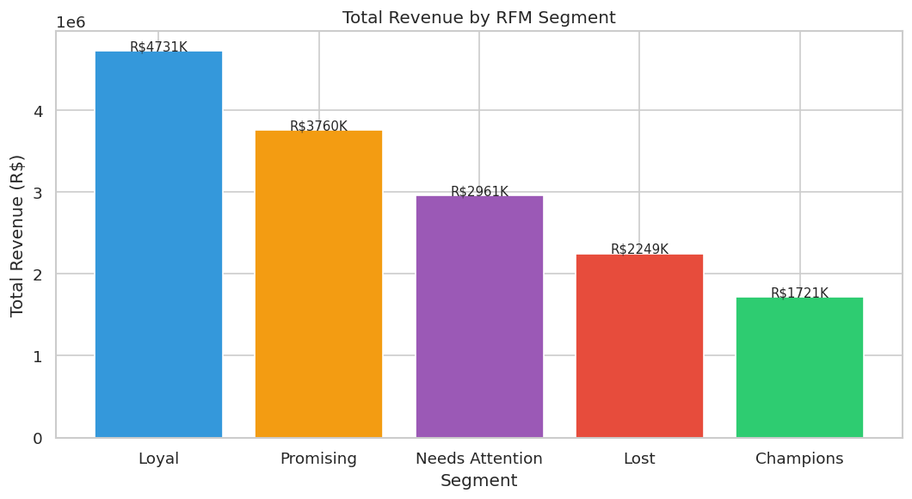

# Olist E-Commerce: Performance and Customer Insights

A full analysis of 99,441 orders placed on Olist, a Brazilian online marketplace, between October 2016 and August 2018. The work moves from raw relational data in MySQL, through SQL and Python analysis, into a four-page Power BI dashboard. This write-up covers the problem, the approach, what the data showed, and what a business could do about it.

> This is a real but anonymized public dataset. The findings demonstrate analysis skills and are not operational advice for any current company.

---

## Problem

Olist sat on nine relational tables covering orders, payments, reviews, customers, products, and sellers, but no single view tied them together. The business needed answers to three questions:

- **Growth:** How did revenue and order volume move over time, and what actually drove the change?
- **Delivery and satisfaction:** Do late deliveries hurt customer reviews, and by how much?
- **Customer value:** Which customers are worth the most, and where is the biggest revenue opportunity hiding?

Each question mattered for a different decision. Growth framing tells you whether to invest in acquisition or retention. The delivery question tells you whether logistics is a satisfaction problem or just an operations cost. The customer-value question tells you where to spend marketing budget.

---

## Approach

The analysis ran in four layers, each one feeding the next.

**Database and SQL.** All nine tables were loaded into MySQL. Five SQL scripts handled the heavy lifting with CTEs and window functions: revenue trends, delivery performance, RFM segmentation, and product category analysis. Reviews had 547 orders with duplicate entries, so a `ROW_NUMBER()` dedup kept one review per order before any satisfaction math ran.

**Python EDA.** A Jupyter notebook reproduced and visualized the SQL findings with Pandas, Matplotlib, and Seaborn. Building the RFM segments from scratch in Python and matching them to the SQL output served as a cross-check: two independent implementations landing on the same numbers is a strong signal the logic is right.

**Power BI dashboard.** A four-page report (Executive Overview, Geographic Performance, Product Category Performance, and Customer Segmentation) turned the analysis into something a stakeholder can actually explore.

**One data trap worth naming.** The `customer_id` field is unique per order, not per person. Counting it would massively overstate the customer base. All customer-level work uses `customer_unique_id`, which is what makes the 97% one-time-buyer finding below trustworthy.

---

## Insights

### Revenue grew on volume, not bigger baskets

Revenue climbed roughly 20x from the first full month (October 2016, R$59K) to November 2017 (R$1.19M), with a **+53% jump in November 2017** that lines up cleanly with Black Friday. The important detail is what did not change: average order value stayed flat in a R$147 to R$182 band the entire time. So growth came from more orders, not larger ones. That points retention and acquisition efforts at order frequency rather than upsell.

### Late delivery is the clearest lever on satisfaction

Delivery ran well overall, with a **91.9% on-time rate** against the platform's own estimated dates. The reviews show why that number matters. On-time orders averaged a **4.29** review score. Late orders averaged **2.57**, a **1.72 point gap**. The Pearson correlation between days late and review score is -0.27, which is meaningful for a single operational variable. Customers forgive a lot, but they do not forgive a missed delivery date.

### Almost every customer buys once and never returns

This is the headline. Of 93,358 unique customers who received a delivered order, **90,557 (97%) ordered only once.** Repeat purchasing is close to nonexistent. That single fact reframes the whole growth story: the business is very good at acquiring a first order and very weak at earning a second.

### The RFM segments show where the money actually is

Scoring every customer on recency, frequency, and monetary value produced five segments. The revenue split is uneven in a useful way:

| Segment | Customers | Share | Revenue |
| :--- | ---: | ---: | ---: |
| Loyal | 17,706 | 19.0% | R$4.74M |
| Promising | 23,356 | 25.0% | R$3.77M |
| Needs Attention | 22,516 | 24.1% | R$2.97M |
| Lost | 23,651 | 25.3% | R$2.26M |
| Champions | 6,129 | 6.6% | R$1.72M |

Two things stand out. **Champions are only 6.6% of customers but generate R$1.72M**, so a small group carries outsized value and is worth protecting. And **Promising, the recent one-time buyers, is the single largest segment at 25%.** These are people who just bought, which makes them the warmest possible audience for a second-purchase push.

### Health and beauty leads, but no category dominates

Health and beauty is the top category at R$1.44M, about 9% of total revenue. No category runs away with the marketplace, which fits the picture of broad, volume-driven growth rather than a single hero product line.

---

## Business Impact

The analysis turns a flat dataset into a short list of decisions.

**Treat the second purchase as the core growth metric.** With 97% of customers ordering once, even a small lift in repeat rate compounds fast. The Promising segment is the obvious starting point because those buyers are recent and already engaged. A targeted second-purchase campaign there has a higher ceiling than spending the same budget on new acquisition.

**Protect Champions deliberately.** A group that is 6.6% of customers and R$1.72M of revenue deserves its own retention track. Losing a Champion costs far more than losing an average buyer.

**Treat on-time delivery as a satisfaction investment, not just a cost.** The 1.72 point review gap between late and on-time orders is the strongest single driver of dissatisfaction in the data. Every order pulled back inside its estimated window protects the review score that future buyers read before purchasing.

**Plan capacity around the Black Friday pattern.** The November 2017 spike was real and large. Knowing demand concentrates there lets the business staff logistics ahead of it and protect the on-time rate exactly when volume threatens it most.

---

## Tools

MySQL and advanced SQL (CTEs, window functions) for the core analysis. Python (Pandas, Matplotlib, Seaborn) for EDA and validation. Power BI for the interactive dashboard. Git and GitHub for version control.

Full SQL scripts are in `sql/`, the Python notebook is `notebooks/01_eda_analysis.ipynb`, and the dashboard is `Olist E-Commerce Analysis.pbix`.
