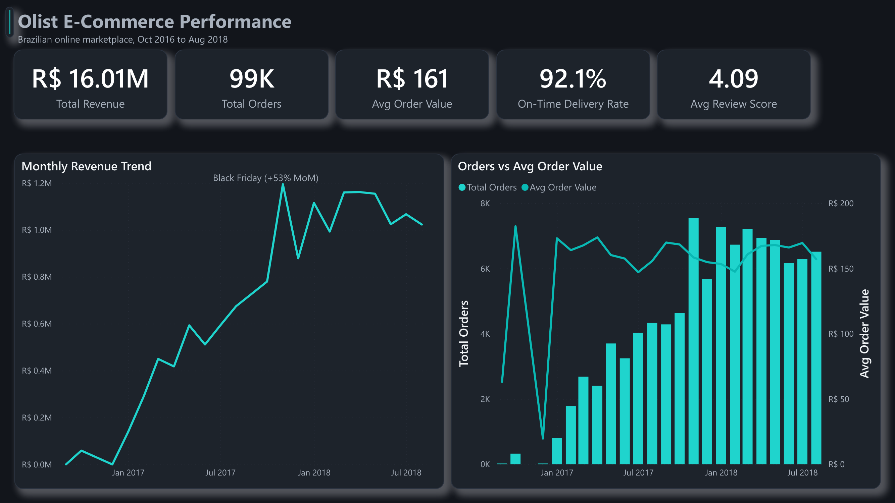
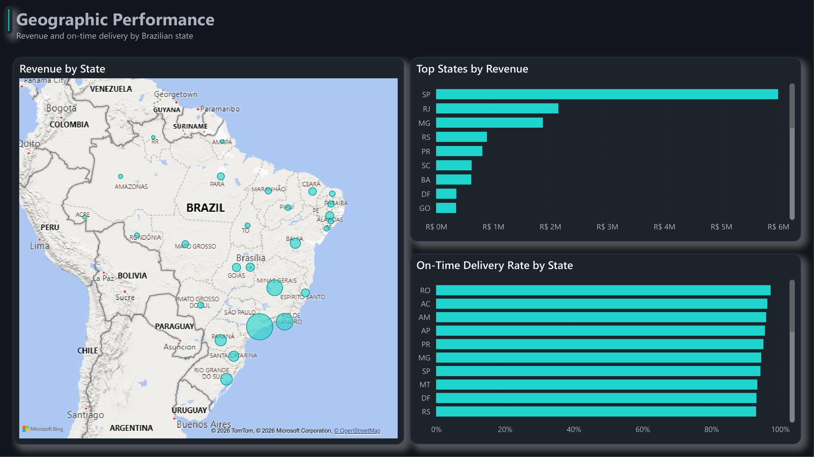
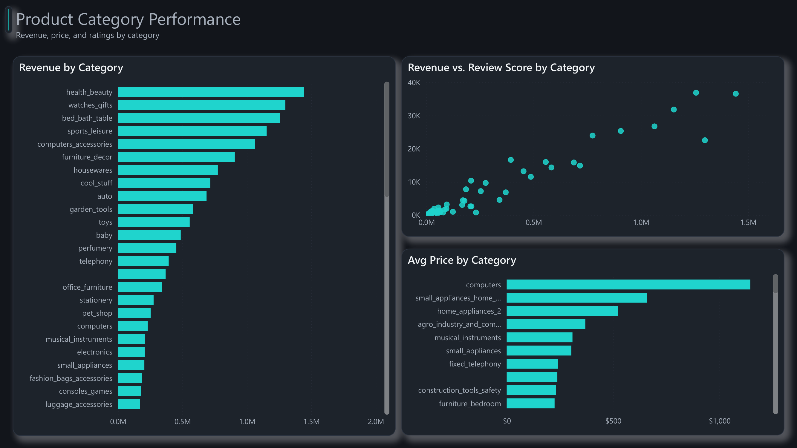
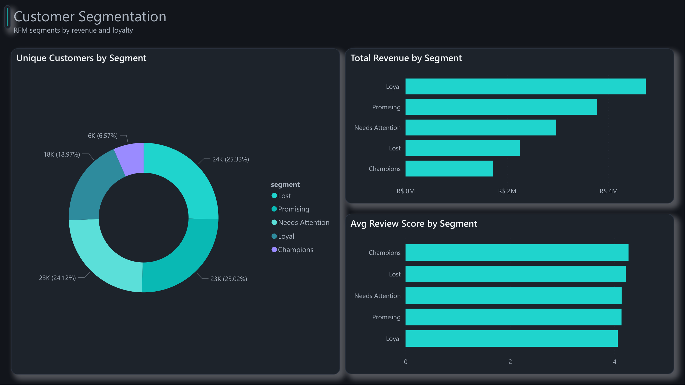

# Olist E-Commerce Performance & Customer Insights

## Overview

This project analyzes 100,000+ orders from Olist, a Brazilian e-commerce marketplace, to answer three core business questions:

1. How has revenue and order volume trended over time, and what's driving changes?
2. Where are delivery failures concentrated, and how do they affect customer satisfaction?
3. Which customers are the most valuable, and what does RFM segmentation reveal?

**Note:** This is a real but anonymized public dataset. Findings are for portfolio and skill demonstration purposes.

---

## Tools & Stack

| Layer | Tool |
| :---- | :---- |
| Database | MySQL |
| SQL Analysis | Advanced SQL (CTEs, window functions) |
| Python | Pandas, Matplotlib, Seaborn |
| Dashboard | Power BI |
| Version Control | Git, GitHub |

---

## Dataset

**Brazilian E-Commerce Public Dataset by Olist**
Source: [kaggle.com/datasets/olistbr/brazilian-ecommerce](https://www.kaggle.com/datasets/olistbr/brazilian-ecommerce)

9 relational tables: orders, order items, payments, reviews, customers, geolocation, sellers, products, and category translations.

---

## Repository Structure

```
olist-ecommerce-analysis/
├── sql/                             # SQL scripts, named by analysis
├── notebooks/                       # Jupyter notebook for EDA and validation
├── screenshots/                     # Dashboard pages and key charts
├── data/                            # Dataset (gitignored, download from Kaggle)
├── Olist E-Commerce Analysis.pbix   # Power BI dashboard
├── olist-theme.json                 # Custom Power BI theme
├── CASE_STUDY.md                    # Full write-up
└── README.md                        # This file
```

---

## Dashboard

A four-page Power BI dashboard (`Olist E-Commerce Analysis.pbix`) on a custom dark theme.

**Executive Overview**: headline KPIs, the monthly revenue trend, and orders vs average order value.



**Geographic Performance**: revenue and on-time delivery by Brazilian state.



**Product Category Performance**: revenue, review scores, and average price by category.



**Customer Segmentation**: RFM segments by customer count, revenue, and review score.



---

## Key Findings

- **Growth was volume-driven, not basket-driven.** Revenue grew ~20x from Oct 2016 (R$59K) to Nov 2017 (R$1.19M), including a +53% Black Friday spike, while average order value stayed flat at R$147 to R$182.
- **Late delivery is the clearest driver of poor reviews.** On-time delivery ran at 91.9%. On-time orders averaged a 4.29 review score versus 2.57 for late orders, a 1.72 point gap.
- **97% of customers ordered only once** (90,557 of 93,358 unique delivered-order customers), so repeat purchasing is the biggest untapped lever.
- **Value is concentrated.** Champions are 6.6% of customers but generate R$1.72M; the Promising segment (recent one-time buyers) is the largest at 25% and the warmest target for a second purchase.
- **Health & beauty leads categories** at R$1.44M (~9% of revenue), with no single category dominating.

See the full [Case Study](CASE_STUDY.md) for the complete write-up.

---

## How to Run

1. Download the dataset from Kaggle (link above) and place CSVs in a local `data/` folder.
2. Run `sql/00_setup_database.sql` in MySQL to create the database and load all tables.
3. Open the Jupyter notebooks in `notebooks/` for Python analysis.
4. Open `Olist E-Commerce Analysis.pbix` in Power BI Desktop.

---

## Case Study

Full write-up in [CASE_STUDY.md](CASE_STUDY.md): Problem, Approach, Insights, and Business Impact.
